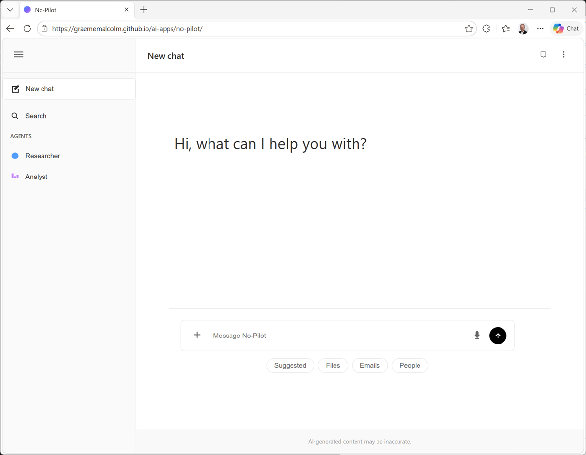
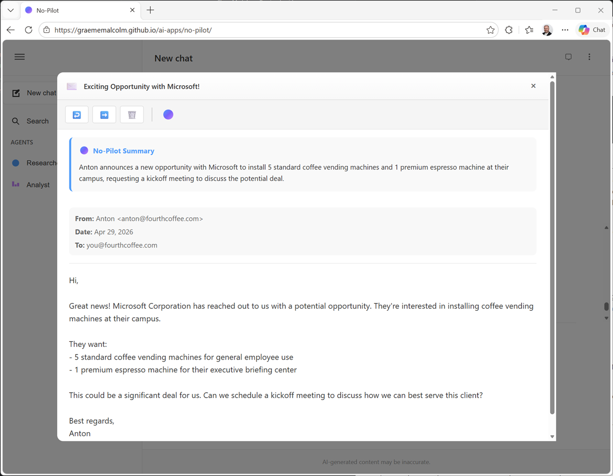
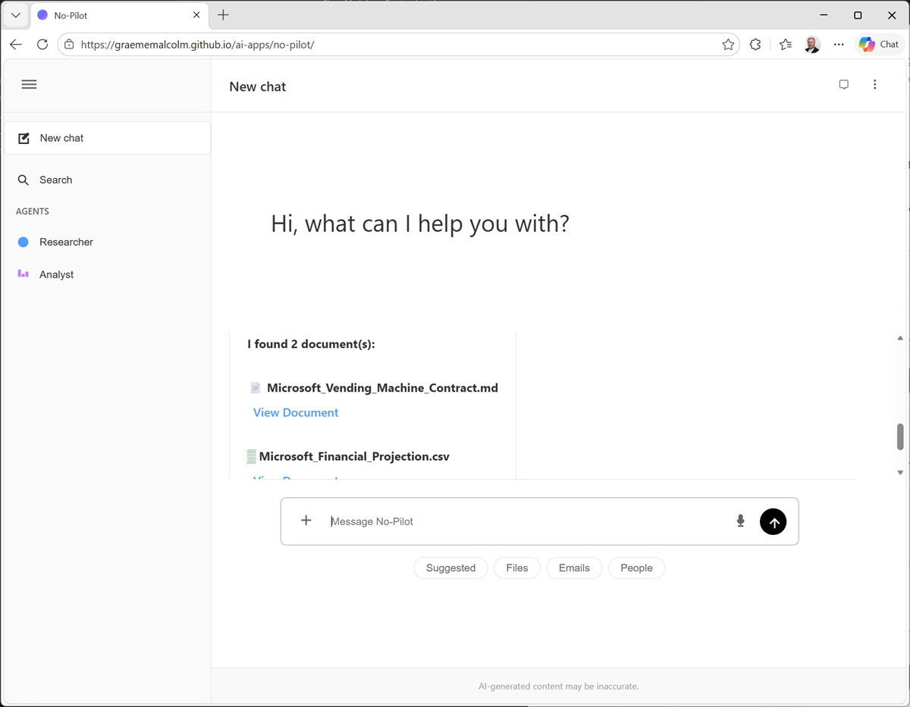
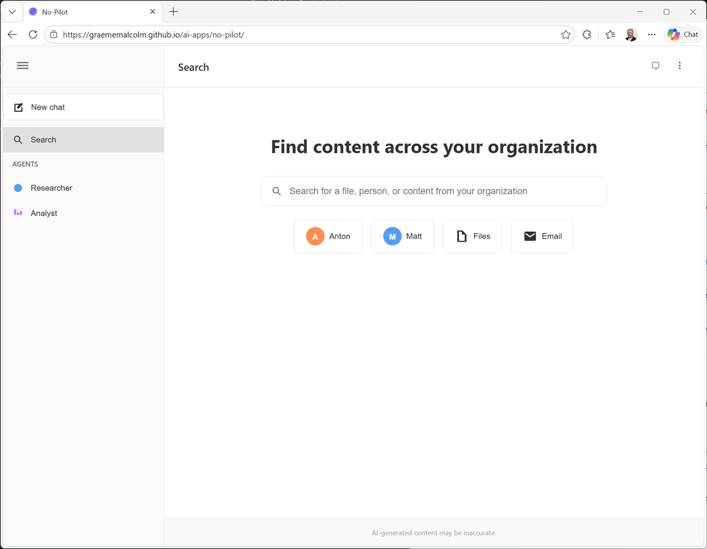
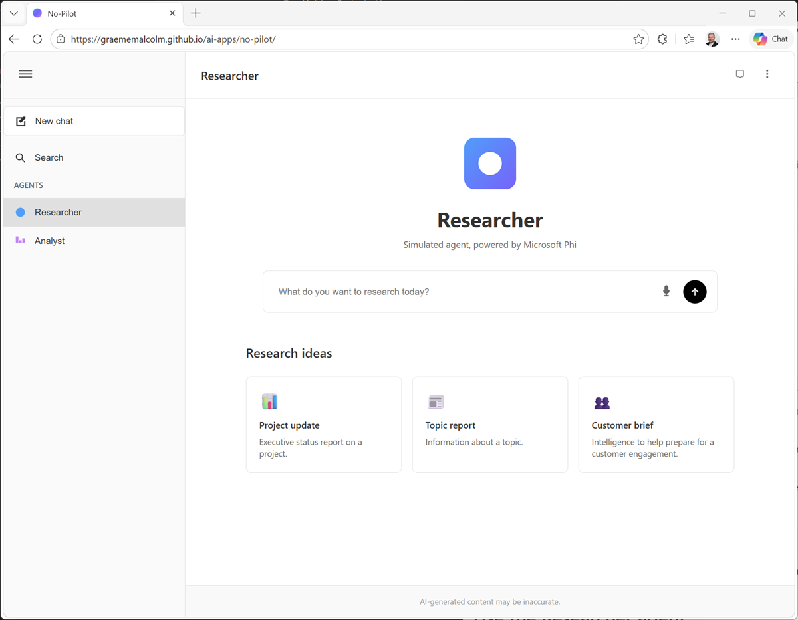
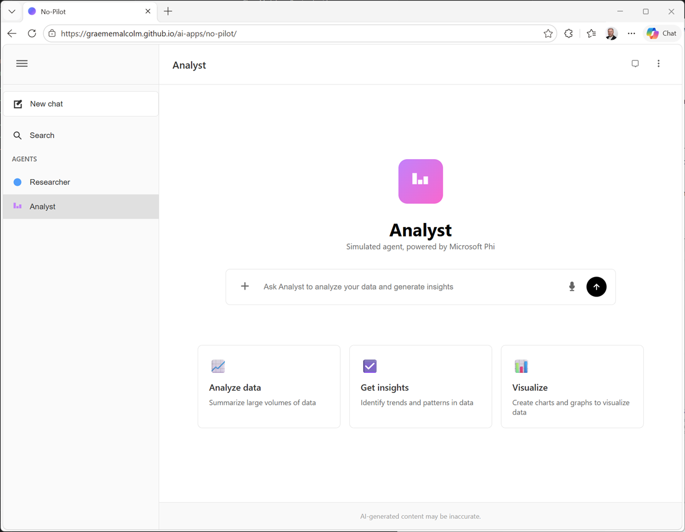

---
lab:
    title: 'Explore No-Pilot (a Copilot-like experience)'
    description: 'Explore the basics of using Copilot at work - without a Microsoft 365 Copilot account.'
    duration: 0  # duration in minutes
    level: 100 # 100 basic concepts, 200 foundations, 300 practical usage, 400 advanced scenarios, 500 expert design
    islab: false # if this is not a lab that should be listed in the catalog, set to false
    status: 'in-development' # in-development or released
    targetDate: 2099-01-0' # Set to the future date when you expect an in-development lab to be released
---

# Explore No-Pilot (a Copilot-like experience)

In this exercise you'll use a lightweight application that emulates key features of Microsoft 365 Copilot Chat. While the app is in no way meant to reflect the actual performance and reasoning capabilities of the *real* Copilot; it offers a chance to explore common workflows and scenarios in which you might use Copilot at work.

This exercise should take approximately **30** minutes to complete.

## Before you start

*(The technical stuff)*

You do <u>not</u> need a Microsoft 365 subscription or cloud account to complete this lab. Instead, you'll use an application that runs in your browser and is a hybrid of a *real* AI application (it uses real models and produces real responses) and a *simulation* (it uses "canned" data to represent the kinds of information you might find in a typical work environment).

The application should run successfully on most modern computers. To use the full capabilities of the app, you will need a computer with the following specifications:

- GPU required for the best performance.
- 64-bit CPU, 4+ physical cores (8 logical threads preferred)
- 8+ GB system RAM (16 GB recommended)
- Enough storage to cache ~300MB–800MB model assets
- Latest Chrome / Microsoft Edge / Firefox with WASM SIMD enabled/available (WebGPU support is required for the default model; a WASM-based fallback is provided)
- Audio hardware (mic and speaker) required for speech functionality

If your computer meets these requirements, the app will use a GPU-based model (Microsoft Phi 3.1 mini). If no GPU is available, the app will fall back to a CPU-based Phi 2 model. If *that* fails to load, the app will use a simulated model that retrieves information from Wikipedia. The performance and accuracy of the AI capabilities of the app is largely dependent on the model.

If you're unsure - try it and see. You can explicitly select the Wikipedia-based fallback in the **&vellip;** menu at the top right if the app is running too slowly or errors occur.

## Chat with *No-Pilot*

Imagine you're an employee at *Fourth Coffee Company*, a company that supplies coffee vending machines and supplies to corporate customers.

*No-Pilot* is an AI assistant that you can use at work to find information, connect with company data resources, and perform common tasks.

1. Open **[No-Pilot](https://graememalcolm.github.io/ai-apps/no-pilot/)** at `https://graememalcolm.github.io/ai-apps/no-pilot/`.

    The first time you open the app, an AI model will be downloaded. This can take a minute or two - be patient! After it's been downloaded once, it will be quicker in future!

1. After the app has initialized a model, take a look at the user interface; which should look like this:

    

    Since you're new in the coffee business, let's see if No-Pilot can help you out with some general information. You've heard that the company is about to launch a new "executive" espresso machine; but you're a little hazy on what *espresso* actually is, and why customers would care.

1. In the box at the bottom of the chat interface, enter the prompt `What is espresso?` and wait for a response.

    > **Note**: Depending on the model you're using, the response may take some time.

1. OK, so that's interesting. Let's follow up with `How is it different to instant coffee?`

    Again, wait for the response.

1. So far so good; but you're tired of typing now. Let's try using voice input. Select the microphone button on the right of the chat box and when the mic is listening, say (loudly and clearly) *"What is filter coffee?"*

    > **Tip**: Depending on your browser and operating system, the default Web Speech tool used for voice input may not be supported. In this case, the app will try an alternative offline speech model - so you may be prompted to speak again. If *that* fails, you're stuck with typing I'm afraid!

## Explore organizational knowledge

While it's great that No-Pilot can answer general questions, let's be honest, you could use your favorite search engine to do that. The real value of an AI assistant at work is that it can use organizational knowledge to help you find relevant internal information and collaborate with colleagues more effectively.

1. Under the chat box, view the suggested prompt categories. Then select **Suggested** and in the list of prompts, select **What's on my calendar?**.

    The prompt is entered into the chat box, ready for you to edit or submit.

    Submit it!

1. In the resulting list of appointments, note that there are a couple of meetings related to a "Microsoft opportunity"; including a follow-up meeting that includes you and your colleagues Anton and Matt.

1. In the **People** prompt category, select the **Who is ...?** prompt. Then edit the prompt to be `Who is Anton?` and submit it.

    Aha! Anton is a sales representative. He probably sent you email about this Microsoft opportunity, let's check.

1. In the **Emails** category, select **What emails have I received from ...**, and then edit the prompt to find emails from `Anton`.

    Sure enough! There's an email from Anton about an exciting opportunity with Microsoft.

1. View the details of the **Exciting opportunity with Microsoft** email to open it.

    Then, in the toolbar for the email, use the **No-Pilot assistant** button to summarize the email so you can get the key details without reading the whole thing!

    

    Summarizing content is something that AI assistants do extremely well, and it can be a real time-saver when you're busy trying to keep up with everything - especially when you're new to the coffee vending business!

1. Close the email and return to the main chat interface.

    There are probably some documents that have been created about this opportunity. Let's find those.

1. In the **Files** category, select the **Find documents about...** prompt and then edit it to find documents about `Microsoft`.

    Aha! It looks like there's a vending machine contract document already created.

    

1. On the left of the chat box, use the **+** button to add work content to the chat, selecting the **Microsoft_Vending_Machine_Contract.md** document.

    Then, with the document attached, enter the prompt `What's in this document?` and view the response.

## Search for information

The chat interface is great for exploring assets related to your current work, but sometimes you may need a more expansive search of your organization's data.

1. In the navigation bar, select the **Search** pane.

    

1. Search for `Coffee`. Predictably enough, this returns many results, including people, documents, and emails.

    Note that the search results are restricted to corporate data to which you (and No-Pilot) have access!

1. Search for **Services**, and in the results, find and open the **Fourth_Coffee_Services_Overview.md** document.

    In the open document, use the **No-Pilot assistant** button to summarize the document.

1. Close the services overview document.

    Now you know a little more about the services Fourth Coffee Company offers. But what do you know about your customer?

## Use the Researcher agent

AI agents are intelligent applications that can not only use a language model to chat, but can also perform tasks based on specific instructions and tools to which they have access.

The *Researcher* agent is a specialized AI assistant that can find and distill large amounts of information into a useful report.

1. In the navigation pane, select the **Researcher** pane.

    

1. In the researcher chat box, enter the prompt `Tell me about Microsoft`.
1. The researcher may ask you what kind of report you want. Choose whichever you want, and the researcher will go off, find the data, and compile it into a report for you.

    > **Note**: Generating the report may take some time.

1. View the completed report. Hopefully it provides some useful background information to help you prepare for the customer meeting.

## Use the Analyst agent

The *Analyst* agent is focused on a different specialization from the researcher. It's designed to analyze data.

1. In the navigation pane, select the **Analyst** page.

    

1. In the analyst search box, use the **+** icon to add work content, and upload the **Microsoft_Financial_Projection.csv** document.

    This document contains a financial projection for monthly costs and revenues based on the proposed contract to supply vending machines to Microsoft.

1. With the document attached, in the chat box, enter the prompt `Analyze and visualize the data in this projection`.

    Wait for the results, and then view the analysis.

## Summary

In this exercise, you explored a lightweight application that emulates some basic tasks that give you flavor of what's possible with Microsoft 365 Copilot. It's important to recognize that this application uses very small models and basic functionality for the purposes of the lab exercise. In reality, Microsoft 365 Copilot offers *significantly* greater reasoning, analytical, and organizational integration than we've explored here.

Learn more about Microsoft 365 Copilot at <https://www.microsoft.com/microsoft-365-copilot>.
